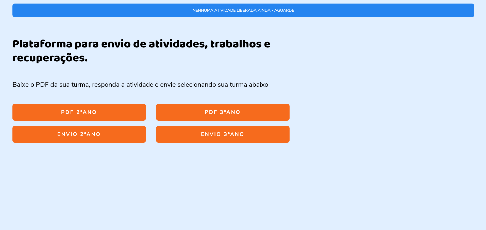

# 📂 Plataforma de Gestão de Atividades Escolares
 

## 📌 Introdução
Este projeto é uma evolução de uma plataforma simples que criei há 8 meses para gerenciar atividades escolares. A versão anterior era básica, com funcionalidades limitadas e um design simples. Agora, após meses de estudo e prática, aprimorei a plataforma, tornando-a mais funcional, responsiva e visualmente atraente. Este README documenta a jornada de aprendizado e as melhorias implementadas.

 

## 📌 Objetivo
O objetivo principal desta plataforma é fornecer uma solução centralizada e intuitiva para que os alunos possam baixar e enviar atividades escolares de forma fácil e direta.  
Este projeto surgiu quando percebi que, ao final de todo bimestre letivo, eu não conseguia organizar as atividades dos meus alunos. Eu precisava repetir as mesmas informações em todas as salas, enviar as atividades em cada grupo da escola e ainda organizar o envio deles, pois alguns imprimiam, enviavam no WhatsApp ou no e-mail da escola, assim, dificultando a correção. 
 

Esta plataforma facilitou a comunicação com os alunos e responsáveis e centralizou o envio dessas atividades direto para meu e-mail institucional. A nova versão foi projetada para ser mais acessível, com um design moderno e responsivo, que melhora a experiência do usuário.

 

## 📌 Ferramentas Utilizadas

 

## 📌 Visualização do Projeto Atual
[Link da Demo do projeto](https://danvasquesc.github.io/projeto-plataforma-atividades-escolares)
 

Aqui está um GIF mostrando a nova versão da plataforma em ação:

 

## 📌 Versão Antiga
A versão antiga da plataforma foi meu primeiro projeto significativo utilizando HTML e CSS. Na época, meu conhecimento era bastante limitado, e o objetivo principal era criar uma solução funcional, mesmo que básica, para organizar as atividades escolares dos meus alunos:

 

## 📌 Como o Usuário Pode Usar
**Acesso à Página:** Os alunos acessam a página via link fornecido em aula.

**Download da Atividade:** Clicam no botão correspondente a sua turma para baixar o PDF da atividade.

**Envio da Atividade:** Após completar a atividade, os alunos clicam no botão de envio para submeter a tarefa direto no meu e-mail institucional, preenchendo somente o nome completo e turma no assunto do e-mail e anexando a atividade.

 

## 📌 Dificuldades Encontradas
Durante o desenvolvimento, enfrentei várias dificuldades, especialmente com a integração da imagem ao lado do texto. Na versão anterior, não consegui alinhar a imagem de forma satisfatória, o que afetou a estética e a responsividade da página. Após estudar documentações e tutoriais, aprendi a utilizar propriedades CSS como `flexbox` e `grid` para resolver esses problemas, além de saber onde posicionar a imagem no HTML. Agora, na nova versão, consegui integrar a imagem que eu queria na forma que projetei no Canva. 
 

Outra dificuldade que tive foi na organização das sessões do site. Eu não sabia como funcionava e como me ajudaria imensamente a construir melhor cada parte, por isso, como não tinha conhecimento, juntei tudo em uma única parte com título, parágrafo e botões, sem instrução alguma ao usuário. Com os estudos, compreendi que cada parte de um site possui sua semântica apropriada no HTML, que não serve apenas como boa prática, mas de fato para auxiliar na construção do layout. Com isso, separei cada parte de acordo com sua função, tornando a página bem intuitiva. 

 

## 📌 Considerações Finais
Este projeto representa uma jornada de aprendizado e melhoria contínua. A evolução da plataforma mostra como o estudo e a prática podem transformar uma ideia simples em uma solução eficiente. Estou aberto a contribuições e sugestões para continuar melhorando esta plataforma.

---

### Feito por [Dan!](https://github.com/danvasquesc) :sparkles: 
